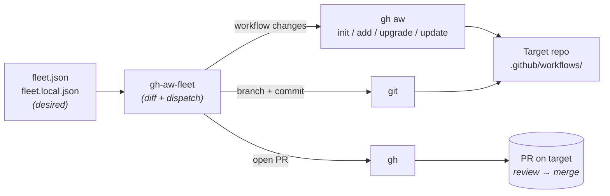

# gh-aw-fleet

Declarative fleet manager for GitHub Agentic Workflows.

[](https://github.com/rshade/gh-aw-fleet/releases/latest)
[](LICENSE)
[](go.mod)

Documentation: <https://rshade.github.io/gh-aw-fleet/>

## Status

Pre-1.0 (see the latest-release badge above). Public surfaces (CLI flags,
`fleet.json` schema) may still change before v1.0. The core reconcile loop
(`deploy`, `sync`, `upgrade`, `add`) plus read-only drift detection
(`status`) is functional. `template fetch` works but is still being
extended.

## Why

When you manage 3+ repositories that deploy agentic workflows—markdown-authored
workflows that compile to GitHub Actions and run AI agents—keeping them
consistent becomes tedious. Each repo independently pins a version of `gh-aw`,
drifts on its own, and requires manual sync cycles. `gh-aw-fleet` centralizes
that: a single `fleet.json` declares the desired state (which repos get which
workflows), and `deploy`, `sync`, and `upgrade` commands bring each repo in
line via `gh aw add/update/upgrade` under the hood.

When those workflows run under
[usage-based Copilot billing](https://github.blog/news-insights/company-news/github-copilot-is-moving-to-usage-based-billing/)—which
lands on 2026-06-01—every deployed workflow consumes credits at metered rates,
and per-repo tools (`gh aw`, the GitHub Actions UI) can't see across the fleet
to tell you where the credits went. The same `fleet.json` that declares which
repos get which workflows is also the natural place to attribute consumption:
by repo, by profile, or by cost center. The `consumption` subcommand does
exactly that — `gh-aw-fleet consumption` (default `--source logs`) reads
AI-credit (AIC) usage from `gh aw logs --json` per agentic workflow and rolls it
up `--by repo|profile|cost-center|workflow`, with USD derived as AIC × $0.01.
Pass one or more repos by name (`gh-aw-fleet consumption rshade/finfocus --by
workflow`) to scope the rollup and drill into a single repo's per-workflow
spend; omit them for the whole fleet. It
needs no deployed reporting workflow ([#57](https://github.com/rshade/gh-aw-fleet/issues/57),
[#103](https://github.com/rshade/gh-aw-fleet/issues/103)); see
[ROADMAP.md](ROADMAP.md) for the broader billing-readiness arc.

## Who is this for?

**You'll get value if:**

- You operate **3 or more repositories** that use (or want to use)
  [`gh-aw`](https://github.com/github/gh-aw)-compiled agentic workflows.
- You want one place to declare *which workflows belong on which repos*,
  pinned to specific upstream refs, and a way to bring drifted repos back
  in line.
- You're comfortable with PR-based change flow — every fleet operation that
  touches a repo opens a PR there; nothing force-pushes or commits directly
  to `main`.

**You probably don't need this if:**

- You operate **one repo** — use `gh aw` directly; there's no fleet to
  manage.
- You want to **author** new workflows — that's `gh aw`'s job. This tool
  only deploys what already exists upstream.
- You want a **hosted SaaS or daemon** — this is a CLI you run on your
  laptop or in CI; no server, no webhook, no background reconciler.

## How It Works

**1. gh-aw ships the compiler; `githubnext/agentics` ships the library.**
`gh-aw` is the markdown→GitHub Actions compiler and an internal dogfooding
testbed. The curated, reusable workflows live in the `githubnext/agentics`
repository. The `default` profile sources workflows from agentics whenever
an equivalent exists, falling back to gh-aw only for workflows that don't
exist elsewhere (currently: `audit-workflows`, `docs-noob-tester`,
`mergefest`).

**2. The tool is a thin orchestrator.** It never rewrites workflow markdown.
It only invokes `gh aw init` (initializes the dispatcher agent in target
repos that don't yet have one), `gh aw add` (writes the `source:`
frontmatter pin), `gh aw upgrade` (bumps action SHAs + recompiles),
`gh aw update` (pulls upstream workflow source + 3-way merge), and
`git`/`gh` for branching, commits, and PRs. All value comes from answering
*who gets what workflow, when, and from which profile*—not from file
manipulation.

**3. Pin-per-profile.** Each profile declares a `sources` map keyed by
upstream repository (e.g., `github/gh-aw`, `githubnext/agentics`), each
with its own ref. The shipped `default` profile pins `github/gh-aw` to a
tagged release (e.g. `v0.79.2`) and `githubnext/agentics` to a specific
commit SHA — never `main`, since moving refs are forbidden by the
[project constitution](CONTEXT.md). A profile advances atomically: bumping
one source ref re-pins every workflow in that profile sourced from that
repo.

**4. Declarative reconcile.** `fleet.json` is the source of truth.
Commands like `deploy`, `sync`, and `upgrade` compute diffs between desired
and actual state, then apply them. Edits to `fleet.json` become commits;
the tool brings reality in line.

### The reconcile loop at a glance



`gh-aw-fleet` itself never touches workflow markdown — it only computes
*what* should change and dispatches the actual work to `gh aw`, `git`,
and `gh`.

### Concepts

- **Profile** — a named bundle of workflows (`default`, `quality-plus`,
  etc.) that can be applied to one or more repos. Defined in `fleet.json`
  under `profiles.<name>`.
- **Source** — the upstream repository a workflow comes from. Currently
  either `github/gh-aw` (compiler + dogfooding workflows) or
  `githubnext/agentics` (the curated library). Each profile pins each
  source to a specific ref.
- **Pin** — a fixed reference (tag like `v0.79.2` or commit SHA) that
  locks a source to a known-good version. Moving refs like `main` are
  forbidden by the [project constitution](CONTEXT.md).
- **Spec** — an `owner/repo/path@ref` string (e.g.,
  `github/gh-aw/.github/workflows/audit-workflows.md@v0.79.2`) that
  uniquely identifies one workflow at one version. The tool resolves
  profile + source + workflow name → spec, then passes it to `gh aw add`.
- **Reconcile** — compute the diff between desired state (`fleet.json`)
  and actual state (the target repo's `.github/workflows/` directory),
  then apply just enough commands to bring them into agreement.
- **Dry-run gate** — `deploy`, `sync`, and `upgrade` print what they would
  do but make no changes unless `--apply` is passed. This is the default
  safety mechanism for any operation that touches an external repo.

## Why not just…?

- **Hand-rolled bash loop over `gh aw add`?** Works for 1-2 repos. Past
  that, you re-derive the loop, the dry-run flag, the profile-to-workflow
  expansion, and the diagnostic hint patterns each time. This tool
  packages all of that.
- **Renovate or Dependabot?** They bump dependency manifests; they don't
  speak agentic-workflow source pinning, profile composition, or `gh aw`'s
  3-way merge semantics. Different abstraction.
- **Terraform / Pulumi for workflow files?** Overkill — there's no
  infrastructure here, just markdown files and PRs. And the actual
  compilation and pin management lives in `gh aw`; wrapping it in HCL or
  TypeScript would re-implement what `gh aw` already does.
- **A `gh aw` extension that adds fleet semantics?** Plausible alternative
  — listed as a possible future direction in [CONTEXT.md](CONTEXT.md). For
  now, this lives outside `gh aw` to evolve independently of the upstream
  tool's release cadence.

## Quick Start

### Prerequisites

- `gh` CLI authed to your GitHub instance (`gh auth login`) with `repo`
  and `workflow` scopes
- `gh aw` extension installed: `gh extension install github/gh-aw` —
  install a tagged release matching the `github/gh-aw` ref in your
  `fleet.json` (the shipped `default` profile uses `v0.79.2`). Because
  v0.79.x are tagged as pre-releases, pin the install explicitly:
  `gh extension install github/gh-aw --pin v0.79.2` — a bare
  `gh extension upgrade aw` stops at the latest *stable* (v0.77.5). Avoid
  `main`: it often contains unreleased features that break this tool.
- Go 1.26.4+ **only if** installing via `go install` or building from
  source

### Install

**Recommended — one-liner installer.** Fetches the installer from the
latest release's assets, then downloads the matching archive for your
OS/arch, verifies its SHA-256 against `checksums.txt`, and installs the
binary:

```bash
# Linux / macOS — installs to $HOME/.local/bin
curl -sSfL \
  https://github.com/rshade/gh-aw-fleet/releases/latest/download/install.sh \
  | bash
```

```powershell
# Windows (PowerShell) — installs to %LOCALAPPDATA%\gh-aw-fleet\bin
iwr -UseBasicParsing https://github.com/rshade/gh-aw-fleet/releases/latest/download/install.ps1 `
  | iex
```

Prefer `go install github.com/rshade/gh-aw-fleet@latest`, a manual release
download, or a source build? Need to pin a version, change the install
directory, or fix a `PATH` that doesn't include the binary? The
**[Install guide](https://rshade.github.io/gh-aw-fleet/install/)** covers
every option and the `main`-branch installer fallback.

### First commands

```bash
gh-aw-fleet list                                 # tracked repos + resolved workflows
gh-aw-fleet status                               # drift across the fleet (read-only)
gh-aw-fleet add acme/widgets --profile default   # onboard a repo (dry-run)
gh-aw-fleet deploy acme/widgets                  # preview a deploy (dry-run)
gh-aw-fleet deploy acme/widgets --apply          # commit + push + open a PR
```

`add` writes to **`fleet.local.json`** (private, gitignored), not `fleet.json`.
`deploy`, `sync`, and `upgrade` are dry-run by default; add `--apply` to commit,
push, and open a PR on the target repo.

New here? The
**[Getting Started tutorial](https://rshade.github.io/gh-aw-fleet/getting-started/)**
walks an empty fleet through to a reviewed pull request, and the
**[CLI reference](https://rshade.github.io/gh-aw-fleet/cli/)** lists every command,
flag, and exit code.

## Commands

| Command | Description |
| --- | --- |
| `list` | List tracked repos and their resolved workflow sets |
| `add <owner/repo>` | Add a repo to `fleet.local.json` (dry-run by default) |
| `deploy <repo>` | Deploy the declared workflow set via `gh aw add` + PR; `--strict` blocks HIGH Layer 1 security findings |
| `sync <repo>` | Reconcile to declared profile (add missing, flag drift); `--strict` blocks HIGH Layer 1 security findings |
| `upgrade [repo\|--all]` | Bump profile pins + run `gh aw upgrade`; `--strict` blocks HIGH Layer 1 security findings |
| `consumption` | Fleet-wide AI-credit (AIC) rollup from `gh aw logs --json` (`--source logs`, default); group `--by repo\|profile\|cost-center\|workflow`, window `--latest\|--trailing Nd\|--since YYYY-MM-DD`, flag over-budget rows with `--budget <AIC>` |
| `overview [repo...]` | Joined drift, run-health, no-op, AIC, and cost dashboard; defaults to `--trailing 7d`; exits non-zero only on drift/errored repos |
| `template fetch` | Refresh `templates.json` from gh-aw and agentics |
| `status [repo]` | Diff desired vs actual workflow refs (read-only, no clones) |

See the [CLI reference](https://rshade.github.io/gh-aw-fleet/cli/) for every
flag, argument, and exit code.

## Configuration

`gh-aw-fleet` is configured through two files (below) plus a set of global
flags (`--dir`, `--log-level`, `--log-format`, `-o`/`--output`) and
per-command flags catalogued in the
[CLI reference](https://rshade.github.io/gh-aw-fleet/cli/).

### Two config files

`gh-aw-fleet` reads from up to two files in the working directory:

1. **`fleet.json`** — the committed base config. The repo ships one
   tracking only `rshade/gh-aw-fleet` itself (the dogfood case); use it
   as a reference for schema, or replace it with your own committed
   fleet if you want shared state across collaborators.
2. **`fleet.local.json`** — a private, gitignored *overlay* on top of
   `fleet.json`. This is where the `add` command writes by default, and
   where you can keep entries that shouldn't be committed (private repos,
   in-flight changes, personal overrides).

When both files exist, they are **merged** — `fleet.local.json` profiles,
repos, and defaults add to or override matching entries in `fleet.json`.
When only one exists, that one is used directly. The stderr line
`(loaded fleet.json + fleet.local.json)` (or `(loaded fleet.json)` /
`(loaded fleet.local.json)` when only one is present) printed at the
start of every command tells you which mode is active.

**Merge granularity is per-entry, not per-field.** A profile (or repo)
defined in `fleet.local.json` replaces the matching entry in `fleet.json`
wholesale — including optional fields like `tier` or `cost_center` that
the local copy may omit. If `fleet.json` declares `"default": { "tier":
"standard", ... }` and `fleet.local.json` redefines `"default"` without a
`tier`, the merged view drops the tier. Either keep `tier` / `cost_center`
in the local copy, or drop the duplicate profile/repo entry so the base
definition flows through unmodified.

To start from scratch, copy `fleet.example.json` to `fleet.local.json`
(or to `fleet.json` if you want it committed) and edit, or use
`gh-aw-fleet add` to generate entries.

### Full schema and flags

The complete configuration and CLI surface lives on the docs site:

- **[Configuration](https://rshade.github.io/gh-aw-fleet/configuration/)** — the
  full `fleet.json` schema (`version`, `defaults`, `profiles`, `sources`,
  `workflows`), every `RepoSpec` field (`compile_strict`, `tier`, `cost_center`,
  `extra`, `exclude`, `overrides`), the compile-strict resolution order, and
  HuJson (`//` comments, trailing commas) support.
- **[CLI reference](https://rshade.github.io/gh-aw-fleet/cli/)** — global flags,
  every command's flags, and exit codes.
- **[Reconcile workflow](https://rshade.github.io/gh-aw-fleet/reconcile/)** — the
  `--strict` security gate, interactive findings confirmation, and `--yes`.

## Bundled Profiles

Each entry below lists what the profile adds, who it's for, and the
underlying workflow set.

### `default` — baseline; every tracked repo

Low-noise, broadly useful. 12 workflows (3 gh-aw + 9 agentics).

- **gh-aw**: `audit-workflows`, `docs-noob-tester`, `mergefest`.
- **agentics**: `ci-doctor`, `code-simplifier`, `daily-doc-updater`,
  `daily-malicious-code-scan`, `pr-fix`, `weekly-issue-summary`,
  `issue-arborist`, `sub-issue-closer`, `dependabot-pr-bundler`.

### `quality-plus` — PR-generating quality agents

Noisier. Best for actively-developed repos. 3 agentics workflows:
`daily-test-improver`, `daily-perf-improver`,
`repository-quality-improver`.

### `security-plus` — SAST, secret scanning, outbound-traffic audits

Best for repos handling sensitive data. Layers on top of `default`'s
`daily-malicious-code-scan`. 3 gh-aw workflows: `daily-semgrep-scan`,
`daily-secrets-analysis`, `daily-firewall-report`.

### `docs-plus` — heavier docs maintenance

Best for repos with a `docs/` directory or published docs site. 6
agentics workflows: `glossary-maintainer`, `unbloat-docs`, `update-docs`,
`link-checker`, `markdown-linter`, `daily-multi-device-docs-tester`.

### `community-plus` — contributor-facing helpers

Command-triggered, dormant when idle. Best for public repos with
external contributors. 4 agentics workflows: `grumpy-reviewer`,
`pr-nitpick-reviewer`, `archie`, `repo-ask`.

## templates.json

Upstream catalog cache. Populated by `template fetch`. Lists every
workflow available from each source (gh-aw, agentics), with parsed
frontmatter, descriptions, triggers, tools, permissions, and full body
text. This is reviewable inline—humans or LLMs can evaluate new workflows
and diffs without re-fetching from GitHub. When `template fetch` detects
new or changed workflows, it suggests pointing Claude at `templates.json`
for evaluation and profile recommendations.

## Design Choices

**Thin orchestrator, not re-implementation.** The tool delegates workflow
compilation to `gh aw`, not a homegrown parser. This means improvements
to `gh aw` flow through automatically; there's no separate maintenance
burden.

**Asymmetry in deploy vs upgrade.** `deploy` uses the pins from
`fleet.json`. `upgrade` follows the workflow's own frontmatter pin (the
`source:` field written by `gh aw add`), then bumps that. This is
intentional: it allows independent per-workflow decisions while `deploy`
enforces fleet-wide consistency. To force a re-pin from `fleet.json`
after editing it, run `gh-aw-fleet sync --apply --force <repo>` rather
than `upgrade` — `upgrade` will not pick up `fleet.json` changes on its
own. This asymmetry concerns the per-workflow `source:` refs only:
`deploy`, `sync`, and `upgrade` all refresh gh-aw *init artifacts* to the
fleet's `github/gh-aw` pin and record a fleet manifest, so an `upgrade`
never leaves a stale dispatcher/init layout behind.

**Dry-run by default.** `deploy`, `sync`, and `upgrade` default to
dry-run mode. Pass `--apply` to commit, push, and open PRs. This prevents
surprises.

**Security strict is opt-in.** Add `--strict` to `deploy`, `sync`, or `upgrade`
when HIGH Layer 1 security findings should hard-stop the run before mutation.
The failure preserves the clone and writes `findings.json` for post-mortem
inspection.

**Conventional Commits.** All generated commits follow the format
`ci(workflows): <description>`, making them easy to filter from
changelogs.

## Diagnostic Hints

When a command fails (e.g., `gh aw add` returns an error), the tool scans
output for known error patterns and surfaces remediation hints. Examples:

- `Unknown property: mount-as-clis` → "This workflow uses an unreleased
  gh-aw feature. Upgrade your CLI or pin to a tagged release."
- `HTTP 404` → "Check the spec—github/gh-aw workflows live under
  `.github/workflows/`; githubnext/agentics workflows live under
  `workflows/`."
- `gpg failed to sign` → "Unlock gpg-agent in your shell and re-run." See
  [Troubleshooting](#troubleshooting) below for the manual-finish recipe.

## Troubleshooting

### gpg signing failed during `--apply`

The most common `--apply` failure: the tool runs `git commit`
non-interactively, so a signing-required config with a passphrase prompt
has nowhere to surface it. The tool never bypasses signing — it preserves
the clone so you can finish the commit in your own shell. See
**[Recover from a gpg signing failure](https://rshade.github.io/gh-aw-fleet/recover-from-gpg-failure/)**
for the manual-finish recipe.

### `Unknown property: mount-as-clis` and similar pre-flight failures

A workflow uses a feature that is in upstream `gh-aw` `main` but not yet
in your installed CLI. Either upgrade the CLI
(`gh extension upgrade gh-aw`), or — preferably — pin the source ref in
`fleet.json` to a tagged release and run
`gh-aw-fleet sync --apply --force <repo>` to re-pin.

### `agentics-maintenance.yml`: `string should not be empty [syntax-check]`

`gh aw` generates `.github/workflows/agentics-maintenance.yml` (the
scheduled cleanup/maintenance workflow) with an empty `workflow_dispatch`
choice option — `operation: ''`. That empty value is **semantically
required**: the workflow's scheduled jobs gate on `inputs.operation == ''`.
But `actionlint`'s `syntax-check` rule — run by `gh aw compile --strict`,
which public repos default to — rejects empty strings, so a strict compile
fails:

```text
.github/workflows/agentics-maintenance.yml:46:13: string should not be empty [syntax-check]
```

The workflow file is marked **`DO NOT EDIT`** (it's regenerated by
`gh aw compile`), so don't patch it — the edit would be overwritten. Instead
suppress the one error in a separate `actionlint` config that `gh aw compile`
never touches. Add `.github/actionlint.yaml` to the repo:

```yaml
paths:
  .github/workflows/agentics-maintenance.yml:
    ignore:
      - 'string should not be empty'
```

`actionlint` reads this whether your CI runs it via `gh aw compile --strict`
or standalone, and the scope (one file, one error pattern) masks nothing
else. The suppression survives `gh aw compile` regenerating the workflow.
This is an upstream `gh-aw` generator/validator inconsistency — the CLI emits
a file its own strict check rejects.

### Resuming after a partial failure

The `--work-dir <path>` flag re-runs `deploy` / `sync` / `upgrade` against
a preserved `/tmp/gh-aw-fleet-*` clone instead of cloning fresh, resuming
at the commit or push gate. See
**[Resume an interrupted apply](https://rshade.github.io/gh-aw-fleet/resume-interrupted-apply/)**.

## Known Limitations & Roadmap

- **Sync dry-run doesn't do deploy preflight.** `sync --dry-run` computes
  the diff but doesn't pre-validate that the workflows would deploy
  successfully.
- **No GitHub extension packaging yet.** `gh-aw-fleet` is distributed as
  a standalone CLI (release binary, `go install`, or build from source —
  see [Install](#install)), not as a `gh` extension. Extension packaging
  is planned.

## Further reading

- **Docs site** — <https://rshade.github.io/gh-aw-fleet/>:
  [Getting Started](https://rshade.github.io/gh-aw-fleet/getting-started/)
  (tutorial); the how-to guides
  ([gate CI on drift](https://rshade.github.io/gh-aw-fleet/gate-ci-on-drift/),
  [recover from gpg](https://rshade.github.io/gh-aw-fleet/recover-from-gpg-failure/),
  [resume an apply](https://rshade.github.io/gh-aw-fleet/resume-interrupted-apply/),
  [find credit burners](https://rshade.github.io/gh-aw-fleet/find-top-credit-burners/));
  the [CLI reference](https://rshade.github.io/gh-aw-fleet/cli/) and
  [Configuration](https://rshade.github.io/gh-aw-fleet/configuration/); and the
  [Reconcile](https://rshade.github.io/gh-aw-fleet/reconcile/) and
  [Consumption and FinOps](https://rshade.github.io/gh-aw-fleet/consumption/)
  explanations.
- **[CONTEXT.md](CONTEXT.md)** — the project constitution. Architectural
  identity, hard scope boundaries, and what this tool deliberately does
  *not* do. Read before proposing features.
- **[ROADMAP.md](ROADMAP.md)** — what's actively being built within those
  boundaries.
- **[CHANGELOG.md](CHANGELOG.md)** — release history (managed via
  [release-please](https://github.com/googleapis/release-please)).
- **`skills/`** — operator playbooks codifying recurring workflows. Each
  is a complete runbook with the three-turn dry-run → approval → apply
  pattern:
  - [`fleet-deploy`](skills/fleet-deploy/SKILL.md) — deploy a profile to
    one repo (includes the gpg manual-finish recipe).
  - [`fleet-upgrade-review`](skills/fleet-upgrade-review/SKILL.md) — bump
    source pins and review the resulting PR.
  - [`fleet-onboard-repo`](skills/fleet-onboard-repo/SKILL.md) — add a
    brand-new repo to the fleet.
  - [`fleet-eval-templates`](skills/fleet-eval-templates/SKILL.md) —
    evaluate upstream template catalog for new workflows.
  - [`fleet-build-profile`](skills/fleet-build-profile/SKILL.md) —
    materialize a chosen workflow set as a `fleet.json` profile.
- **[CLAUDE.md](CLAUDE.md)** — invariants for AI coding agents working
  in this repo. Useful for human contributors too as a quick reference.

## Contributing & Development

See [ROADMAP.md](ROADMAP.md) for what's actively in flight, and the
[issue tracker](https://github.com/rshade/gh-aw-fleet/issues) for places
to start. Before opening a PR, run the full local gate:

```bash
make ci         # fmt-check + vet + lint + test (the same gate CI runs)
```

The local development gate is expected to run with Go 1.26.4 and
golangci-lint v2.12.2. Run `make ci` directly; do not pin an older
`GOTOOLCHAIN` unless you are deliberately debugging toolchain drift.

Or step by step:

```bash
make fmt        # apply gofmt
make lint       # golangci-lint — can take 5+ minutes; do not skip
make test       # full test suite
```

If `make ci` passes locally, CI will pass.

**For AI coding agents** working in this repo, see [CLAUDE.md](CLAUDE.md)
for the invariants (no bypassing gpg signing, no direct git invocations,
etc.) and `.claude/settings.json` for the shell-command allowlist that
lets subagents run without prompting.
