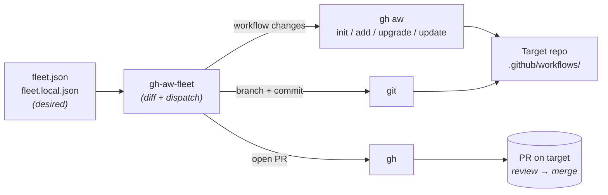

# gh-aw-fleet

Declarative fleet manager for GitHub Agentic Workflows.

[](https://github.com/rshade/gh-aw-fleet/releases/latest)
[](LICENSE)
[](go.mod)

Documentation: <https://rshade.github.io/gh-aw-fleet/>

## Status

Pre-1.0 (see the latest-release badge above). Public surfaces (CLI flags,
`fleet.json` schema) may still change before v1.0. The core reconcile loop
(`deploy`, `sync`, `upgrade`, `add`) plus read-only drift detection
(`status`) is functional. `template fetch` works but is still being
extended.

## Why

When you manage 3+ repositories that deploy agentic workflows—markdown-authored
workflows that compile to GitHub Actions and run AI agents—keeping them
consistent becomes tedious. Each repo independently pins a version of `gh-aw`,
drifts on its own, and requires manual sync cycles. `gh-aw-fleet` centralizes
that: a single `fleet.json` declares the desired state (which repos get which
workflows), and `deploy`, `sync`, and `upgrade` commands bring each repo in
line via `gh aw add/update/upgrade` under the hood.

When those workflows run under
[usage-based Copilot billing](https://github.blog/news-insights/company-news/github-copilot-is-moving-to-usage-based-billing/)—which
lands on 2026-06-01—every deployed workflow consumes credits at metered rates,
and per-repo tools (`gh aw`, the GitHub Actions UI) can't see across the fleet
to tell you where the credits went. The same `fleet.json` that declares which
repos get which workflows is also the natural place to attribute consumption:
by repo, by profile, or by cost center. The `consumption` subcommand does
exactly that — `gh-aw-fleet consumption` (default `--source logs`) reads
AI-credit (AIC) usage from `gh aw logs --json` per agentic workflow and rolls it
up `--by repo|profile|cost-center|workflow`, with USD derived as AIC × $0.01.
Pass one or more repos by name (`gh-aw-fleet consumption rshade/finfocus --by
workflow`) to scope the rollup and drill into a single repo's per-workflow
spend; omit them for the whole fleet. It
needs no deployed reporting workflow ([#57](https://github.com/rshade/gh-aw-fleet/issues/57),
[#103](https://github.com/rshade/gh-aw-fleet/issues/103)); see
[ROADMAP.md](ROADMAP.md) for the broader billing-readiness arc.

## Who is this for?

**You'll get value if:**

- You operate **3 or more repositories** that use (or want to use)
  [`gh-aw`](https://github.com/github/gh-aw)-compiled agentic workflows.
- You want one place to declare *which workflows belong on which repos*,
  pinned to specific upstream refs, and a way to bring drifted repos back
  in line.
- You're comfortable with PR-based change flow — every fleet operation that
  touches a repo opens a PR there; nothing force-pushes or commits directly
  to `main`.

**You probably don't need this if:**

- You operate **one repo** — use `gh aw` directly; there's no fleet to
  manage.
- You want to **author** new workflows — that's `gh aw`'s job. This tool
  only deploys what already exists upstream.
- You want a **hosted SaaS or daemon** — this is a CLI you run on your
  laptop or in CI; no server, no webhook, no background reconciler.

## How It Works

**1. gh-aw ships the compiler; `githubnext/agentics` ships the library.**
`gh-aw` is the markdown→GitHub Actions compiler and an internal dogfooding
testbed. The curated, reusable workflows live in the `githubnext/agentics`
repository. The `default` profile sources workflows from agentics whenever
an equivalent exists, falling back to gh-aw only for workflows that don't
exist elsewhere (currently: `audit-workflows`, `docs-noob-tester`,
`mergefest`).

**2. The tool is a thin orchestrator.** It never rewrites workflow markdown.
It only invokes `gh aw init` (initializes the dispatcher agent in target
repos that don't yet have one), `gh aw add` (writes the `source:`
frontmatter pin), `gh aw upgrade` (bumps action SHAs + recompiles),
`gh aw update` (pulls upstream workflow source + 3-way merge), and
`git`/`gh` for branching, commits, and PRs. All value comes from answering
*who gets what workflow, when, and from which profile*—not from file
manipulation.

**3. Pin-per-profile.** Each profile declares a `sources` map keyed by
upstream repository (e.g., `github/gh-aw`, `githubnext/agentics`), each
with its own ref. The shipped `default` profile pins `github/gh-aw` to a
tagged release (e.g. `v0.79.2`) and `githubnext/agentics` to a specific
commit SHA — never `main`, since moving refs are forbidden by the
[project constitution](CONTEXT.md). A profile advances atomically: bumping
one source ref re-pins every workflow in that profile sourced from that
repo.

**4. Declarative reconcile.** `fleet.json` is the source of truth.
Commands like `deploy`, `sync`, and `upgrade` compute diffs between desired
and actual state, then apply them. Edits to `fleet.json` become commits;
the tool brings reality in line.

### The reconcile loop at a glance



`gh-aw-fleet` itself never touches workflow markdown — it only computes
*what* should change and dispatches the actual work to `gh aw`, `git`,
and `gh`.

### Concepts

- **Profile** — a named bundle of workflows (`default`, `quality-plus`,
  etc.) that can be applied to one or more repos. Defined in `fleet.json`
  under `profiles.<name>`.
- **Source** — the upstream repository a workflow comes from. Currently
  either `github/gh-aw` (compiler + dogfooding workflows) or
  `githubnext/agentics` (the curated library). Each profile pins each
  source to a specific ref.
- **Pin** — a fixed reference (tag like `v0.79.2` or commit SHA) that
  locks a source to a known-good version. Moving refs like `main` are
  forbidden by the [project constitution](CONTEXT.md).
- **Spec** — an `owner/repo/path@ref` string (e.g.,
  `github/gh-aw/.github/workflows/audit-workflows.md@v0.79.2`) that
  uniquely identifies one workflow at one version. The tool resolves
  profile + source + workflow name → spec, then passes it to `gh aw add`.
- **Reconcile** — compute the diff between desired state (`fleet.json`)
  and actual state (the target repo's `.github/workflows/` directory),
  then apply just enough commands to bring them into agreement.
- **Dry-run gate** — `deploy`, `sync`, and `upgrade` print what they would
  do but make no changes unless `--apply` is passed. This is the default
  safety mechanism for any operation that touches an external repo.

## Why not just…?

- **Hand-rolled bash loop over `gh aw add`?** Works for 1-2 repos. Past
  that, you re-derive the loop, the dry-run flag, the profile-to-workflow
  expansion, and the diagnostic hint patterns each time. This tool
  packages all of that.
- **Renovate or Dependabot?** They bump dependency manifests; they don't
  speak agentic-workflow source pinning, profile composition, or `gh aw`'s
  3-way merge semantics. Different abstraction.
- **Terraform / Pulumi for workflow files?** Overkill — there's no
  infrastructure here, just markdown files and PRs. And the actual
  compilation and pin management lives in `gh aw`; wrapping it in HCL or
  TypeScript would re-implement what `gh aw` already does.
- **A `gh aw` extension that adds fleet semantics?** Plausible alternative
  — listed as a possible future direction in [CONTEXT.md](CONTEXT.md). For
  now, this lives outside `gh aw` to evolve independently of the upstream
  tool's release cadence.

## Quick Start

### Prerequisites

- `gh` CLI authed to your GitHub instance (`gh auth login`) with `repo`
  and `workflow` scopes
- `gh aw` extension installed: `gh extension install github/gh-aw` —
  install a tagged release matching the `github/gh-aw` ref in your
  `fleet.json` (the shipped `default` profile uses `v0.79.2`). Because
  v0.79.x are tagged as pre-releases, pin the install explicitly:
  `gh extension install github/gh-aw --pin v0.79.2` — a bare
  `gh extension upgrade aw` stops at the latest *stable* (v0.77.5). Avoid
  `main`: it often contains unreleased features that break this tool.
- Go 1.26.4+ **only if** installing via `go install` or building from
  source

### Install

**Option 1 — One-liner installer (recommended).** Fetches the installer
from the latest release's assets (immutable, pinned to a tagged version);
the installer downloads the matching release archive for your OS/arch,
verifies its SHA-256 against the release's `checksums.txt`, and drops the
binary in your install directory.

```bash
# Linux / macOS — installs to $HOME/.local/bin
curl -sSfL \
  https://github.com/rshade/gh-aw-fleet/releases/latest/download/install.sh \
  | bash
```

```powershell
# Windows (PowerShell) — installs to %LOCALAPPDATA%\gh-aw-fleet\bin
iwr -UseBasicParsing https://github.com/rshade/gh-aw-fleet/releases/latest/download/install.ps1 `
  | iex
```

The release-asset URL is the recommended path — it pins to a tagged
installer, not a moving `main`. If you're on a release that predates the
installer assets and `releases/latest/download/install.*` 404s, fall back
to the `main`-branch installer:

```bash
# Fallback — fetches install.sh from main
curl -sSfL \
  https://raw.githubusercontent.com/rshade/gh-aw-fleet/main/install.sh \
  | bash
```

```powershell
# Fallback — fetches install.ps1 from main
iwr -UseBasicParsing https://raw.githubusercontent.com/rshade/gh-aw-fleet/main/install.ps1 `
  | iex
```

Either way, the installer still installs a tagged release binary by
default: the latest release unless you pin one.

Customizing the install:

- POSIX env vars — `VERSION=v0.2.0` pins a specific release (default:
  latest); `INSTALL_DIR=/usr/local/bin` overrides the default location.
- PowerShell parameters — `-Version v0.2.0` pins a release;
  `-InstallDir <path>` overrides the install directory; `-NoPath` skips the
  user-scope PATH update.

PowerShell parameters require invoking the downloaded script as a
`ScriptBlock`:

```powershell
$installer = [ScriptBlock]::Create(
  (iwr -UseBasicParsing https://github.com/rshade/gh-aw-fleet/releases/latest/download/install.ps1).Content
)
& $installer -Version v0.2.0 -InstallDir "$env:LOCALAPPDATA\gh-aw-fleet\bin" -NoPath
```

**Option 2 — Manual release download.** Pre-built binaries are published
for Linux, macOS, and Windows on amd64 and arm64:

```bash
# Example: Linux amd64
gh release download --repo rshade/gh-aw-fleet --pattern '*linux_amd64.tar.gz'
tar -xzf gh-aw-fleet_*_linux_amd64.tar.gz
sudo mv gh-aw-fleet /usr/local/bin/
```

See the
[latest release](https://github.com/rshade/gh-aw-fleet/releases/latest)
for all available platform archives and checksums.

**Option 3 — `go install`.** Installs into `$(go env GOPATH)/bin`:

```bash
go install github.com/rshade/gh-aw-fleet@latest
```

**Option 4 — Build from source.** For contributors and anyone working off
`main`:

```bash
git clone https://github.com/rshade/gh-aw-fleet.git
cd gh-aw-fleet
go build -o gh-aw-fleet .
```

> **Note on examples below:** all command examples use bare `gh-aw-fleet`
> and assume the binary is on your `PATH`. Option 1 installs to
> `$HOME/.local/bin` by default — make sure that's on your PATH. Option 3
> installs to `$(go env GOPATH)/bin`, which is not automatically on PATH —
> add it yourself if `which gh-aw-fleet` comes back empty. Option 2 lets
> you pick the destination. If you built from source via Option 4 and
> didn't install the binary, prefix every `gh-aw-fleet` command with `./`
> to run it from the build directory.

### Example Workflow

List tracked repos and their resolved workflow sets:

```bash
gh-aw-fleet list
```

Fetch the upstream catalog (templates.json) so you can review new
workflows:

```bash
gh-aw-fleet template fetch
```

Onboard a new repo into `fleet.local.json` with a profile (`acme/widgets`
is a placeholder — substitute your `<owner>/<repo>`). Dry-run first, then
`--apply`:

```bash
# dry-run; prints planned change
gh-aw-fleet add acme/widgets --profile default
# interactive: prompts for confirmation
gh-aw-fleet add acme/widgets --profile default --apply
# non-interactive (CI / scripts): skips prompt
gh-aw-fleet add acme/widgets --profile default --apply --yes
```

The repo entry is written to **`fleet.local.json`** (the private,
gitignored config), not `fleet.json` (the committed example). See
[Two config files](#two-config-files) below.

Dry-run a deploy to one repo (shows what would be added, no changes
made):

```bash
gh-aw-fleet deploy acme/widgets
```

Apply the deploy (commits, pushes, opens a PR in the target repo):

```bash
gh-aw-fleet deploy acme/widgets --apply
```

Reconcile a repo (add missing workflows, flag unexpected ones):

```bash
gh-aw-fleet sync HavenTrack/goa-service-shared --apply
```

Upgrade all repos to the latest gh-aw and agentics versions:

```bash
gh-aw-fleet upgrade --all --apply
```

Check drift across the fleet without cloning anything (exits 0 only when
every repo is aligned — chain it before a deploy in CI):

```bash
gh-aw-fleet status
gh-aw-fleet status -o json \
  | jq '.result.repos | map(select(.drift_state == "drifted")) | length'
```

## Commands

| Command | Description |
| --- | --- |
| `list` | List tracked repos and their resolved workflow sets |
| `add <owner/repo>` | Add a repo to `fleet.local.json` (dry-run by default) |
| `deploy <repo>` | Deploy the declared workflow set via `gh aw add` + PR |
| `sync <repo>` | Reconcile to declared profile (add missing, flag drift) |
| `upgrade [repo\|--all]` | Bump profile pins + run `gh aw upgrade` |
| `consumption` | Fleet-wide AI-credit (AIC) rollup from `gh aw logs --json` (`--source logs`, default); group `--by repo\|profile\|cost-center\|workflow`, window `--latest\|--trailing Nd\|--since YYYY-MM-DD` |
| `template fetch` | Refresh `templates.json` from gh-aw and agentics |
| `status [repo]` | Diff desired vs actual workflow refs (read-only, no clones) |

## Configuration

### Global flags

All commands accept these persistent flags:

- **`--dir <path>`** (default: `.`) — Directory containing `fleet.json` /
  `fleet.local.json`.
- **`--log-level <level>`** (default: `info`) — Log verbosity: `trace`,
  `debug`, `info`, `warn`, `error`. Use `debug` to see every subprocess
  invocation, timing, and exit code.
- **`--log-format <format>`** (default: `console`) — Log format: `console`
  (human-readable on stderr) or `json` (structured logs for `jq` /
  aggregators).
- **`-o`, `--output <format>`** (default: `text`) — Output format: `text`
  (tabular human view) or `json` (machine-readable envelopes for
  scripting). Supported on `list`, `deploy`, `sync`, `upgrade`, and
  `status` (`upgrade --all` emits NDJSON). Rejected with a clear error on
  `template fetch` and `add`.

For multi-repo failure debugging,
[`skills/fleet-deploy/SKILL.md`](skills/fleet-deploy/SKILL.md) recommends
`--log-level=debug --log-format=json 2>/tmp/log.json` and traversing
subprocess events with `jq`.

### Two config files

`gh-aw-fleet` reads from up to two files in the working directory:

1. **`fleet.json`** — the committed base config. The repo ships one
   tracking only `rshade/gh-aw-fleet` itself (the dogfood case); use it
   as a reference for schema, or replace it with your own committed
   fleet if you want shared state across collaborators.
2. **`fleet.local.json`** — a private, gitignored *overlay* on top of
   `fleet.json`. This is where the `add` command writes by default, and
   where you can keep entries that shouldn't be committed (private repos,
   in-flight changes, personal overrides).

When both files exist, they are **merged** — `fleet.local.json` profiles,
repos, and defaults add to or override matching entries in `fleet.json`.
When only one exists, that one is used directly. The stderr line
`(loaded fleet.json + fleet.local.json)` (or `(loaded fleet.json)` /
`(loaded fleet.local.json)` when only one is present) printed at the
start of every command tells you which mode is active.

**Merge granularity is per-entry, not per-field.** A profile (or repo)
defined in `fleet.local.json` replaces the matching entry in `fleet.json`
wholesale — including optional fields like `tier` or `cost_center` that
the local copy may omit. If `fleet.json` declares `"default": { "tier":
"standard", ... }` and `fleet.local.json` redefines `"default"` without a
`tier`, the merged view drops the tier. Either keep `tier` / `cost_center`
in the local copy, or drop the duplicate profile/repo entry so the base
definition flows through unmodified.

To start from scratch, copy `fleet.example.json` to `fleet.local.json`
(or to `fleet.json` if you want it committed) and edit, or use
`gh-aw-fleet add` to generate entries.

### fleet.json schema

The declarative desired state. Top-level keys:

- **`version`**: Schema version (currently `1`).
- **`defaults`**: Fleet-wide defaults. Currently: `engine` (e.g.,
  `"copilot"` for all repos unless overridden).
- **`profiles`**: Named bundles of workflows. See
  [Bundled Profiles](#bundled-profiles) below.
- **`repos`**: Per-repo desired state (profiles, excludes, extras,
  overrides).

Example fragment:

```json
{
  "version": 1,
  "defaults": {
    "engine": "copilot"
  },
  "profiles": {
    "default": {
      "description": "Baseline every tracked repo gets.",
      "sources": {
        "github/gh-aw": { "ref": "v0.79.2" },
        "githubnext/agentics": {
          "ref": "96b9d4c39aa22359c0b38265927eadb31dcf4e2a"
        }
      },
      "workflows": [
        { "name": "audit-workflows", "source": "github/gh-aw" },
        { "name": "ci-doctor", "source": "githubnext/agentics" }
      ]
    }
  },
  "repos": {
    "acme/widgets": {
      "profiles": ["default"],
      "extra": [
        {
          "name": "shadow-engineer",
          "source": "local",
          "path": ".github/workflows/shadow-engineer.md"
        }
      ]
    }
  }
}
```

### Annotations (HuJson)

`fleet.json`, `fleet.local.json`, `templates.json`, and
`profiles/default.json` all accept [HuJson](https://github.com/tailscale/hujson)
syntax — a JSON superset that allows `//` line comments, `/* */` block
comments, and trailing commas. Operators can document *why* a pin is set,
why a workflow is excluded, or why a repo opts into a `*-plus` profile
right next to the data.

The loader checks for `<base>.hujson` first and falls back to `<base>.json`
if the HuJson variant is absent; having both files present for the same
base name is rejected as ambiguous so the unread file can't silently drift.
Writes preserve operator-authored comments — `gh-aw-fleet add` and
`fleet template fetch` only touch the keys they need to change.

Example:

```hujson
{
  "version": 1,
  "profiles": {
    "default": {
      // Pinned to the v0.79.2 tag — never `main`, which ships unreleased
      // features like `mount-as-clis` that break the installed CLI.
      "sources": {
        "github/gh-aw": { "ref": "v0.79.2" },
      },
      "workflows": [
        { "name": "audit-workflows", "source": "github/gh-aw" },
      ],
    },
  },
  "repos": {
    "acme/widgets": {
      "profiles": ["default", "security-plus"], // legal asked for SAST
    },
  },
}
```

### RepoSpec

Per-repo configuration. Keys:

- **`profiles`** (required): List of profile names to apply.
- **`engine`** (optional): AI engine override (e.g., `"gpt-4"`). Defaults
  to `defaults.engine`.
- **`compile_strict`** (optional): Tri-state toggle for
  `gh aw compile --strict` on this repo's deploy and upgrade pipelines.
  Omit to auto-detect from repo visibility (see "Compile-strict resolution"
  below). Set to `true` to force strict ON regardless of visibility; set to
  `false` to force strict OFF (e.g., a legacy public repo that has
  workflows that can't yet pass strict validation).
- **`extra`** (optional): Additional workflows not from any profile.
  Source can be `"local"` (lives in the target repo) or an upstream repo
  name.
- **`exclude`** (optional): List of workflow names to skip (useful when a
  profile mostly fits but one or two workflows don't).
- **`overrides`** (optional): Map of workflow name → custom path (if the
  upstream path doesn't match convention).

#### Compile-strict resolution

`gh-aw-fleet deploy` and `gh-aw-fleet upgrade` invoke `gh aw compile --strict`
on the work-dir clone after `gh aw add` / `gh aw upgrade` succeeds and
before `git add .github/`. The decision is driven by `RepoSpec.compile_strict`
with this resolution order (FR-003):

1. **Explicit override** — when `compile_strict` is present in `fleet.json` /
   `fleet.local.json`, its value wins. The visibility lookup is skipped
   entirely.
2. **Auto-detect from visibility** — when `compile_strict` is absent, the
   tool calls `gh api /repos/<owner>/<repo>` once per invocation and reads
   the `visibility` field. `"public"` → strict ON; `"private"` or
   `"internal"` or any other value → strict OFF.
3. **Fail-secure on lookup failure** — when the visibility lookup errors
   (HTTP 403/404/5xx, network failure, malformed JSON), the resolver
   defaults to strict ON and emits one `warn`-level structured log line
   naming the repo and a truncated reason. Setting `compile_strict`
   explicitly bypasses this path.

The `--output json` envelope on both Deploy and Upgrade gains three fields:

- `compile_strict_applied` (`bool`) — `true` ONLY when the strict compile
  ran and exited 0 in this invocation. Always `false` in dry-run mode.
- `compile_strict_effective` (`bool`) — the resolver's verdict for this
  repo, independent of whether compile actually ran. In dry-run mode this
  is the "would apply on `--apply`" signal; in `--apply` mode it equals
  `compile_strict_applied` unless the probe or compile aborted.
- `compile_strict_source` (`string`) — one of `"explicit"`, `"auto-public"`,
  `"auto-private"`, `"auto-fallback"`, or `""` (resolver didn't run —
  early error path).

**Minimum `gh aw` version**: `v0.79.2` (the FinOps baseline floor; `compile
--strict` itself has shipped since `v0.68.3`). The tool probes `gh aw compile
--help` before invoking compile and aborts with an actionable diagnostic when
`--strict` is absent. Install with `gh extension install github/gh-aw --pin
v0.79.2` — v0.79.x are pre-releases, so a bare `gh extension upgrade aw` stops
at the latest stable.

Example `fleet.local.json` snippet:

```jsonc
{
  "repos": {
    "rshade/regular-public-repo": {
      "profiles": ["default"]
      // omitted → auto-detect (public → strict ON)
    },
    "rshade/gh-aw-fleet": {
      "profiles": ["default"],
      "compile_strict": true        // explicit force-on (skips visibility lookup)
    },
    "rshade/legacy-public": {
      "profiles": ["default"],
      "compile_strict": false       // opt out for a workflow that can't yet be strict
    }
  }
}
```

See [`specs/010-compile-strict-public/quickstart.md`](specs/010-compile-strict-public/quickstart.md)
for the operator troubleshooting walkthrough.

## Bundled Profiles

Each entry below lists what the profile adds, who it's for, and the
underlying workflow set.

### `default` — baseline; every tracked repo

Low-noise, broadly useful. 12 workflows (3 gh-aw + 9 agentics).

- **gh-aw**: `audit-workflows`, `docs-noob-tester`, `mergefest`.
- **agentics**: `ci-doctor`, `code-simplifier`, `daily-doc-updater`,
  `daily-malicious-code-scan`, `pr-fix`, `weekly-issue-summary`,
  `issue-arborist`, `sub-issue-closer`, `dependabot-pr-bundler`.

### `quality-plus` — PR-generating quality agents

Noisier. Best for actively-developed repos. 3 agentics workflows:
`daily-test-improver`, `daily-perf-improver`,
`repository-quality-improver`.

### `security-plus` — SAST, secret scanning, outbound-traffic audits

Best for repos handling sensitive data. Layers on top of `default`'s
`daily-malicious-code-scan`. 3 gh-aw workflows: `daily-semgrep-scan`,
`daily-secrets-analysis`, `daily-firewall-report`.

### `docs-plus` — heavier docs maintenance

Best for repos with a `docs/` directory or published docs site. 6
agentics workflows: `glossary-maintainer`, `unbloat-docs`, `update-docs`,
`link-checker`, `markdown-linter`, `daily-multi-device-docs-tester`.

### `community-plus` — contributor-facing helpers

Command-triggered, dormant when idle. Best for public repos with
external contributors. 4 agentics workflows: `grumpy-reviewer`,
`pr-nitpick-reviewer`, `archie`, `repo-ask`.

## templates.json

Upstream catalog cache. Populated by `template fetch`. Lists every
workflow available from each source (gh-aw, agentics), with parsed
frontmatter, descriptions, triggers, tools, permissions, and full body
text. This is reviewable inline—humans or LLMs can evaluate new workflows
and diffs without re-fetching from GitHub. When `template fetch` detects
new or changed workflows, it suggests pointing Claude at `templates.json`
for evaluation and profile recommendations.

## Design Choices

**Thin orchestrator, not re-implementation.** The tool delegates workflow
compilation to `gh aw`, not a homegrown parser. This means improvements
to `gh aw` flow through automatically; there's no separate maintenance
burden.

**Asymmetry in deploy vs upgrade.** `deploy` uses the pins from
`fleet.json`. `upgrade` follows the workflow's own frontmatter pin (the
`source:` field written by `gh aw add`), then bumps that. This is
intentional: it allows independent per-workflow decisions while `deploy`
enforces fleet-wide consistency. To force a re-pin from `fleet.json`
after editing it, run `gh-aw-fleet sync --apply --force <repo>` rather
than `upgrade` — `upgrade` will not pick up `fleet.json` changes on its
own. This asymmetry concerns the per-workflow `source:` refs only:
`deploy`, `sync`, and `upgrade` all refresh gh-aw *init artifacts* to the
fleet's `github/gh-aw` pin and record a fleet manifest, so an `upgrade`
never leaves a stale dispatcher/init layout behind.

**Dry-run by default.** `deploy`, `sync`, and `upgrade` default to
dry-run mode. Pass `--apply` to commit, push, and open PRs. This prevents
surprises.

**Conventional Commits.** All generated commits follow the format
`ci(workflows): <description>`, making them easy to filter from
changelogs.

## Diagnostic Hints

When a command fails (e.g., `gh aw add` returns an error), the tool scans
output for known error patterns and surfaces remediation hints. Examples:

- `Unknown property: mount-as-clis` → "This workflow uses an unreleased
  gh-aw feature. Upgrade your CLI or pin to a tagged release."
- `HTTP 404` → "Check the spec—github/gh-aw workflows live under
  `.github/workflows/`; githubnext/agentics workflows live under
  `workflows/`."
- `gpg failed to sign` → "Unlock gpg-agent in your shell and re-run." See
  [Troubleshooting](#troubleshooting) below for the manual-finish recipe.

## Troubleshooting

### gpg signing failed during `--apply`

This is the most common `--apply` failure mode. The tool runs
`git commit` non-interactively, so a signing-required git config that
needs a passphrase prompt has nowhere to surface it. **The tool never
bypasses signing** (no `--no-gpg-sign`, no `commit.gpgsign=false`) — it
preserves the in-progress clone so you can finish the commit in your own
shell where gpg-agent can prompt you.

When `--apply` fails on gpg signing:

1. The clone directory is preserved at
   `/tmp/gh-aw-fleet-<owner>-<repo>-<timestamp>/` with all files staged
   on the deploy branch.
2. `cd` into that directory and finish manually:

   ```bash
   cd /tmp/gh-aw-fleet-<owner>-<repo>-<timestamp>
   git commit -m 'ci(workflows): add <N> agentic workflows via gh-aw-fleet'
   # branch is fleet/deploy-<timestamp>
   git push -u origin <branch-name>
   gh pr create \
     --title "ci(workflows): add <N> agentic workflows via gh-aw-fleet" \
     --body "..."
   ```

3. The full template (with body, conventional-commits validation rules,
   and edge-case handling for `gh aw init` and skipped workflows) is in
   [`skills/fleet-deploy/SKILL.md`](skills/fleet-deploy/SKILL.md).

### `Unknown property: mount-as-clis` and similar pre-flight failures

A workflow uses a feature that is in upstream `gh-aw` `main` but not yet
in your installed CLI. Either upgrade the CLI
(`gh extension upgrade gh-aw`), or — preferably — pin the source ref in
`fleet.json` to a tagged release and run
`gh-aw-fleet sync --apply --force <repo>` to re-pin.

### `agentics-maintenance.yml`: `string should not be empty [syntax-check]`

`gh aw` generates `.github/workflows/agentics-maintenance.yml` (the
scheduled cleanup/maintenance workflow) with an empty `workflow_dispatch`
choice option — `operation: ''`. That empty value is **semantically
required**: the workflow's scheduled jobs gate on `inputs.operation == ''`.
But `actionlint`'s `syntax-check` rule — run by `gh aw compile --strict`,
which public repos default to — rejects empty strings, so a strict compile
fails:

```text
.github/workflows/agentics-maintenance.yml:46:13: string should not be empty [syntax-check]
```

The workflow file is marked **`DO NOT EDIT`** (it's regenerated by
`gh aw compile`), so don't patch it — the edit would be overwritten. Instead
suppress the one error in a separate `actionlint` config that `gh aw compile`
never touches. Add `.github/actionlint.yaml` to the repo:

```yaml
paths:
  .github/workflows/agentics-maintenance.yml:
    ignore:
      - 'string should not be empty'
```

`actionlint` reads this whether your CI runs it via `gh aw compile --strict`
or standalone, and the scope (one file, one error pattern) masks nothing
else. The suppression survives `gh aw compile` regenerating the workflow.
This is an upstream `gh-aw` generator/validator inconsistency — the CLI emits
a file its own strict check rejects.

### Resuming after a partial failure

The `--work-dir <path>` flag points `deploy` / `upgrade` / `sync` at an
existing clone instead of cloning fresh. Use it with the
`/tmp/gh-aw-fleet-*` directory preserved from a failed run to re-attempt
without re-cloning.

When `deploy --apply --work-dir <path>` is run against a preserved clone
that has staged workflow changes, the tool resumes at the commit gate
(skipping clone, `gh aw init`, and `gh aw add`). If the user manually
committed after a GPG failure, the tool detects the unpushed commits and
resumes at the push gate, proceeding directly to `git push` and
`gh pr create`.

## Known Limitations & Roadmap

- **Sync dry-run doesn't do deploy preflight.** `sync --dry-run` computes
  the diff but doesn't pre-validate that the workflows would deploy
  successfully.
- **No GitHub extension packaging yet.** `gh-aw-fleet` is distributed as
  a standalone CLI (release binary, `go install`, or build from source —
  see [Install](#install)), not as a `gh` extension. Extension packaging
  is planned.

## Further reading

- **[CONTEXT.md](CONTEXT.md)** — the project constitution. Architectural
  identity, hard scope boundaries, and what this tool deliberately does
  *not* do. Read before proposing features.
- **[ROADMAP.md](ROADMAP.md)** — what's actively being built within those
  boundaries.
- **[CHANGELOG.md](CHANGELOG.md)** — release history (managed via
  [release-please](https://github.com/googleapis/release-please)).
- **`skills/`** — operator playbooks codifying recurring workflows. Each
  is a complete runbook with the three-turn dry-run → approval → apply
  pattern:
  - [`fleet-deploy`](skills/fleet-deploy/SKILL.md) — deploy a profile to
    one repo (includes the gpg manual-finish recipe).
  - [`fleet-upgrade-review`](skills/fleet-upgrade-review/SKILL.md) — bump
    source pins and review the resulting PR.
  - [`fleet-onboard-repo`](skills/fleet-onboard-repo/SKILL.md) — add a
    brand-new repo to the fleet.
  - [`fleet-eval-templates`](skills/fleet-eval-templates/SKILL.md) —
    evaluate upstream template catalog for new workflows.
  - [`fleet-build-profile`](skills/fleet-build-profile/SKILL.md) —
    materialize a chosen workflow set as a `fleet.json` profile.
- **[CLAUDE.md](CLAUDE.md)** — invariants for AI coding agents working
  in this repo. Useful for human contributors too as a quick reference.
- **[docs/finops.md](docs/finops.md)** — cost tracking for agentic
  workflows. Frames the two-layer model: deployed aggregate rollup (Layer 1,
  via `api-consumption-report` and `gh-aw-fleet consumption`) and optional
  per-run attribution (Layer 2, via agentics `cost-tracker`). Explains the
  trade-offs and why the fleet stops where it does.

## Contributing & Development

See [ROADMAP.md](ROADMAP.md) for what's actively in flight, and the
[issue tracker](https://github.com/rshade/gh-aw-fleet/issues) for places
to start. Before opening a PR, run the full local gate:

```bash
make ci         # fmt-check + vet + lint + test (the same gate CI runs)
```

The local development gate is expected to run with Go 1.26.4 and
golangci-lint v2.12.2. Run `make ci` directly; do not pin an older
`GOTOOLCHAIN` unless you are deliberately debugging toolchain drift.

Or step by step:

```bash
make fmt        # apply gofmt
make lint       # golangci-lint — can take 5+ minutes; do not skip
make test       # full test suite
```

If `make ci` passes locally, CI will pass.

**For AI coding agents** working in this repo, see [CLAUDE.md](CLAUDE.md)
for the invariants (no bypassing gpg signing, no direct git invocations,
etc.) and `.claude/settings.json` for the shell-command allowlist that
lets subagents run without prompting.
